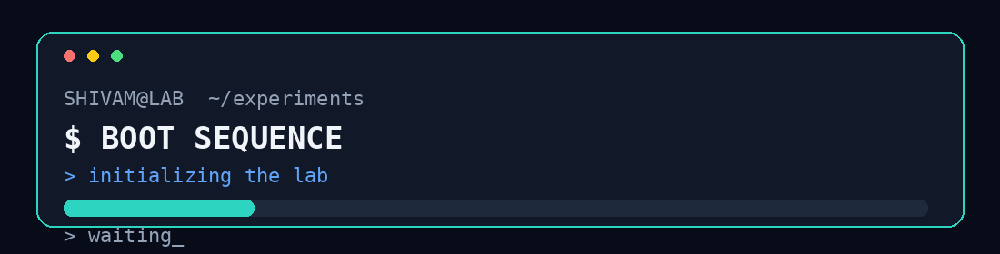

<div align="center">



<a href="https://readme-typing-svg.demolab.com">

</a>

<p>
<a href="https://github.com/khaddeshivam"></a>
</p>

</div>

---

## 👀 You found the lab.

I'm **Shivam**, a Software Development Engineer building software at the intersection of **product engineering and modern AI**.

I like projects with a question behind them:

> **Can software understand something?**  
> **Can it reason over data?**  
> **Can it use tools and take action?**  
> **Can we make the system reliable when things go wrong?**

That rabbit hole is currently taking me through **GenAI → RAG → Agentic AI**.

---

## 🧪 What am I building?

```text
                    ┌───────────────┐
                    │    Problem    │
                    └───────┬───────┘
                            ↓
                  ┌───────────────────┐
                  │  Software System  │
                  └────────┬──────────┘
                           ↓
                 ┌─────────────────────┐
                 │      AI Layer       │
                 │  RAG • LLM • Agent  │
                 └─────────┬───────────┘
                           ↓
                ┌──────────────────────┐
                │   Useful Outcome     │
                └──────────────────────┘
```

My sweet spot is where **good engineering gives AI a real product to live inside**.

# 🚀 Things I've Built

### 💰 FinPilot
**What if a finance app could understand your money instead of only displaying it?**

An AI-native financial platform combining application engineering with ML, RAG and generative AI.

`Java 21` `Spring Boot` `PostgreSQL` `React` `TypeScript` `RAG` `LLMs`

**Explore →** [FinPilot](https://github.com/khaddeshivam/FinPilot)

---

### 🚆 Railway Reservation Backend
**What happens when two people try to grab the same seat?**

A reservation backend built around transactional correctness and concurrent booking scenarios.

`Java` `Spring Boot` `PostgreSQL` `JWT`

**Engineering rabbit hole →** [Concurrency & Reservation Logic](https://github.com/khaddeshivam/railway-reservation-backend)

---

### 🧠 RAG Chatbot
**Can an LLM answer from knowledge it wasn't trained on?**

A document-grounded application combining ingestion, retrieval and generation.

`Python` `RAG` `Chroma` `OpenAI` `Groq` `Anthropic` `Streamlit`

**Try it →** [Live Demo](https://rag-chatbot-fyezzspbhisbfydb7zlbl7.streamlit.app/) · **Code →** [Repository](https://github.com/khaddeshivam/rag-chatbot)

---

### 👥 Employee Management System
**Can application security be designed around roles instead of scattered checks?**

A full-stack application with authentication, authorization and role-specific workflows.

`Spring Boot` `Spring Security` `JWT` `PostgreSQL` `React`

**Explore →** [Repository](https://github.com/khaddeshivam/Employee-Management-System)

---

# 🤖 The AI Rabbit Hole

```text
        GENAI
          │
          ├── LLM Applications
          ├── Prompt Engineering
          │
          ▼
         RAG
          │
          ├── Embeddings
          ├── Vector Search
          ├── Retrieval
          └── Evaluation
          │
          ▼
      AGENTIC AI
          │
          ├── Tool Calling
          ├── Planning
          ├── Memory
          ├── Multi-step Workflows
          └── Autonomous Actions
```

I'm interested in systems where AI can move beyond:

**"Here is an answer."**

toward:

**"Here is what I found → here is what I decided → here is the tool I used → here is what happened."**

---

# 🛠️ Open the Toolbox

<details>
<summary><b>Unlock the stack</b> 🔓</summary>

<br/>

**Languages**


**Application Engineering**


**Data / Infrastructure**


**AI**

`RAG` · `LLMs` · `Embeddings` · `Vector Search` · `Prompt Engineering` · `AI Agents`

</details>

---

# 🧭 Current Mission

```text
[✓] Build software
[✓] Learn by shipping
[✓] Explore GenAI
[ ] Build deeper agentic systems
[ ] Push more experiments into production
[ ] Keep making weird ideas useful
```

---

# 📊 GitHub Telemetry

<div align="center">

<a href="https://github.com/khaddeshivam">

</a>

<a href="https://github.com/khaddeshivam">

</a>

</div>

---

# 🏆 Achievements

<div align="center">


</div>

---

# 🎮 Contribution Arcade

### 🐍 Snake is eating my commits.

<div align="center">

<picture>
<source media="(prefers-color-scheme: dark)" srcset="https://raw.githubusercontent.com/khaddeshivam/khaddeshivam/output/github-contribution-grid-snake-dark.svg">
<source media="(prefers-color-scheme: light)" srcset="https://raw.githubusercontent.com/khaddeshivam/khaddeshivam/output/github-contribution-grid-snake.svg">

</picture>

</div>

---

# 🕹️ Easter Egg

<details>
<summary><b>▶ Press Start</b></summary>

<br/>

```text
╔══════════════════════════════════════╗
║              SHIVAM.EXE             ║
╠══════════════════════════════════════╣
║ CLASS      : SDE                    ║
║ SPECIALTY  : GENAI / AGENTS         ║
║ STATUS     : BUILDING               ║
║ CURIOSITY  : ████████████████████   ║
║ COFFEE     : REQUIRED               ║
╚══════════════════════════════════════╝
```

**Achievement unlocked:** you scrolled this far.

</details>

---

# 🌌 What I Want to Explore Next

Agentic systems that can **retrieve → reason → use tools → act → evaluate**.

Not just another chatbot.

Something that actually **does useful work**.

---

<div align="center">

### Thanks for visiting the lab.

**There is probably another experiment hiding somewhere in these repositories.**

<br>

`Build something curious.`

</div>
